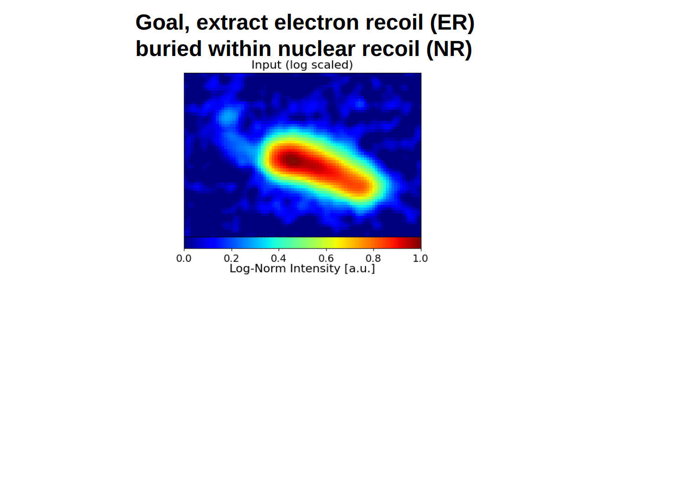

# OASIS Overlap-Aware Segmentation of ImageS

OASIS is a Pytorch-based pixel-level segmentation-regression framework designed to
separate overlapping objects in scientific image data. OASIS employs custom loss
function with region-specific weights that can be tuned to prioritize overlapping
pixels during training. A paper detailing the framework and its performance
on data from the MIGDAL experiment is in progress and will be linked soon.



## Installation

1. Navigate to the parent `OASIS` directory and install the package with

```python
pip install -e .
```

**Note**: Installing OASIS doesn't install any other python packages
so you'll need to install all dependencies. The main ones are
-numpy
-pandas
-pytorch
-matplotlib
-tqdm

## Package Layout
```
OASIS/
  config.py           # OASISConfig (single dataclass)
  datasets.py         # OASISDataset in pytorch
  model.py            # UNetSmall (GroupNorm+SiLU, Softplus head)
  losses.py           # SegRegLoss + masked_tv (smoothness)
  train.py            # train(cfg)
  eval.py	      # evaluate(cfg), view_and_process()
  generate_tensors.py # Script to generate pytorch tensors from dataframe contents
```

## USAGE in a jupyter notebook
```python
from OASIS import OASISConfig, train, evaluate, view_and_process

cfg = OASISConfig(
    data_root="OASIS/data/tensors",
    out_dir="OASIS/data/models",
    epochs=50, batch_size=16, device="cuda"
)

# (once) generate tensors from .feather dataframes:
# !python generate_tensors.py

# Train
"""No training data is included here
but if you have training data you can
of course call train() as shown below
to train a model"""
#model = train(cfg)

# Evaluate (on test NR, for example)
#cfg.eval_split = "test" #this is already handled in the configuration
model, ds, metrics = evaluate(cfg, species="NR")
print(metrics)

# Visualize one
_ = view_one(model, ds, idx=0, invert=True, plot=True)
```
